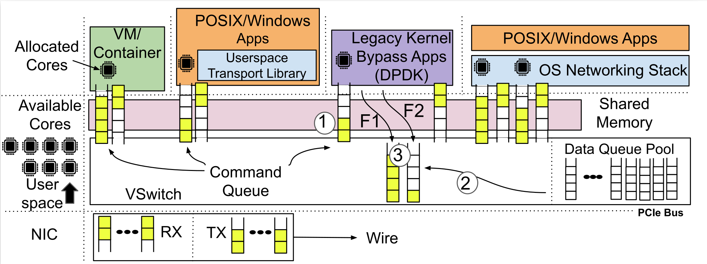

# Backdraft
Backdraft is a new lossless virtual switch that addresses the slow receiver problem by combining three new components: (1) Dynamic Per-Flow Queuing (DPFQ) to prevent HOL blocking and provide on-demand memory usage; (2) Doorbell queues to reduce CPU overheads; (3) A new overlay network to avoid congestion spreading.

## What is the slow receiver problem?
Any networked application is potentially a slow receiver if it is unable to
keep up with the incoming rate.

## System Architetcure


## Repo Layout
```
- /
 - env: all scripts regarding environment setup
 - exp: all scripts regarding experiments in the paper
 - code: all the codes and libraries built for backdraft
 - 
```

## License

MIT

## Disclaimer

This is a research prototype.

## Help

Please use [Github Issues](https://github.com/Lossless-Virtual-Switching/Backdraft/issues).

>>> Still working on the readme!
